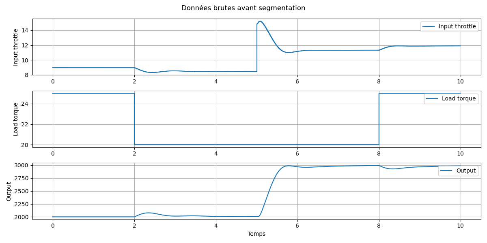
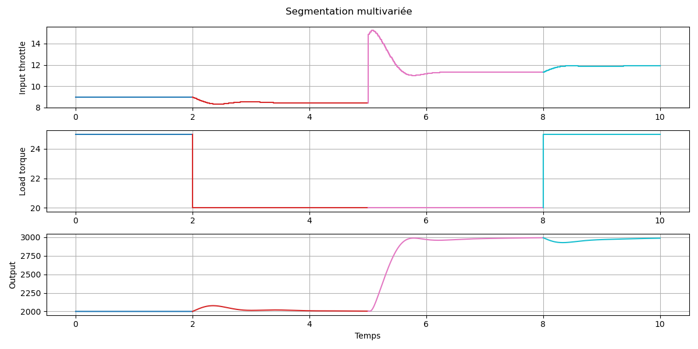

# **Segmentation de Séries Temporelles**

Ce projet a pour objectif de **segmenter des séries temporelles multivariées**, **détecter des ruptures structurelles** et **exporter les points de transition** dans le but d'utiliser ces points pour la construction de condition de garde dans le contexte d'un projet ayant pour but de faire la mise à jour d'automate hybride à temps réel.

## **Structure du dépôt**
```
.
|--- Segmentation.py         # Script principal
|--- Sources.py              # Fonctions principales
|--- Data/                   # Dossier contenant les fichiers.csv d'entrée
|--- Results/                # Dossier de sortie contenant les segments et les points de transition
|--- README.md               # Documentation du projet
```

## **Fontionnement**

### 1. **Chargement des données**
Les données doivent être au format CSV avec la structure suivante:

|   Time    |   Var1    |   Var2    |   Var3    |   ...     |
|   :---:   |   :---:   |   :---:   |   :---:   |   :---:   |
|   0.00    |   12.3    |   45.6    |   1.55    |   ...     |
|   0.01    |   12.4    |   45.7    |   1.6     |   ...     |
|   ...     |   ...     |   ...     |   ...     |   ...     |
|   1000    |   ...     |   ...     |   ...     |   ...     |


### 2. **Calcul des seuils**
Les seuils de segmentation sont calculés dynamiquement


### 3. **Algorithme de segmentation**


### 4. **Export des résultats**

---

## **Utilisation**
Exécution du script principal
```bash
python Segmentation.py
```

Paramètres choisis par défaut:
- **k (facteur de tolérance)**: `1e-3`
- **MinPoints**: `100`

---

## **Exemple de sortie**
- **Logs des ruptures détectées**:
```
=== Logs des ruptures ===
- Segment  1 : à t = 0.5020 --> variable 'Var1'
  Équation de la droite : y = 0.0023 * t + 45.2301
  Erreur = 0.1234 | Seuil = 0.0012
- ...
```

## **Visualisation**:
Dans cette section, on illustre la méthode implementé par une application sur des données issues d'un moteur.

### Données brutes


### Données segmentées


L'objectif de la segmentation est illutré par les differentes couleurs des segments où on a un segment à chaque fois qu'on détecte une rupture.
---
